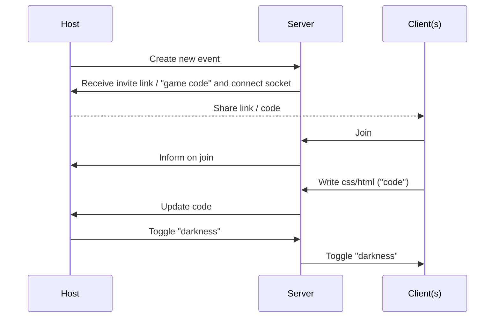

# Code in the dark 👨🏼‍💻🌚

To get started, run:

```
pnpm install
pnpm dev
```

## Sequence diagram



**Host**:
is a web client that connects to the server to create and event, the host can later overview the attendants at the event and admin over them.

**Client(s)**:
The attendants at the event, that "code's in the dark

**Server**:
Some server that preferably are using sockets for live updating of code.
